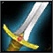

# WoW 군단 직업

## 1.직업의 구분 

탱커 - 적의 공격을 대신 맞아주는 클래스

딜러 - 적을 공격하는데 특화된 클래스

힐러 - 아군의 체력을 회복시키는 클래스

## 2.클레스

## [2.1. 전사](전사.md)  
# 
## [2.2. 사제](사제.md)  
#  
## [2.3. 도적](도적.md)  
#  

## [2.4. 성기사](성기사.md)  
#  

## [2.5. 사냥꾼](사냥꾼.md)  
#  

## [2.6. 주술사](주술사.md)  
#  
## [2.7. 마법사](마법사.md)  
#  
## [2.8. 흑마법사](흑마법사.md)  
#  
## [2.9. 드루이드](드루이드.md)  
#  
## [2.10. 죽음의 기사](죽음의기사.md)  
#  
## [2.11. 수도사](수도사.md)  
#  
## [2.12. 악마사냥꾼](악마사냥꾼.md)  
#  

 
